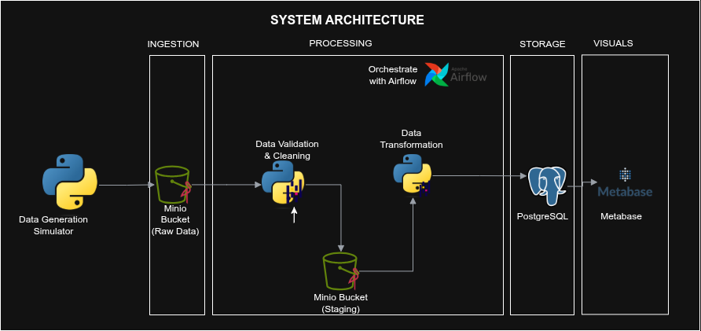
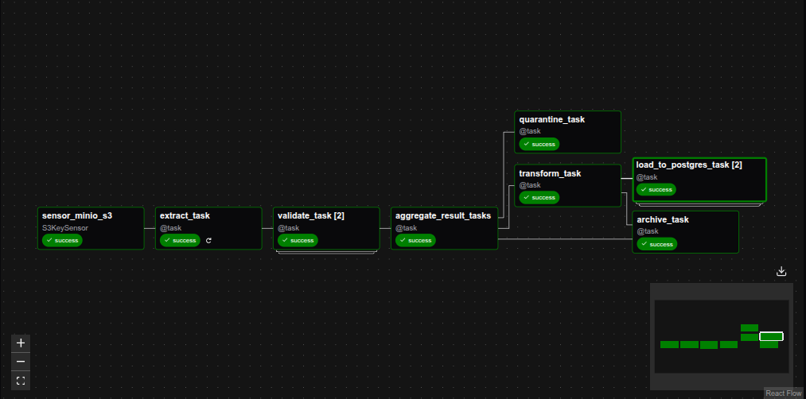
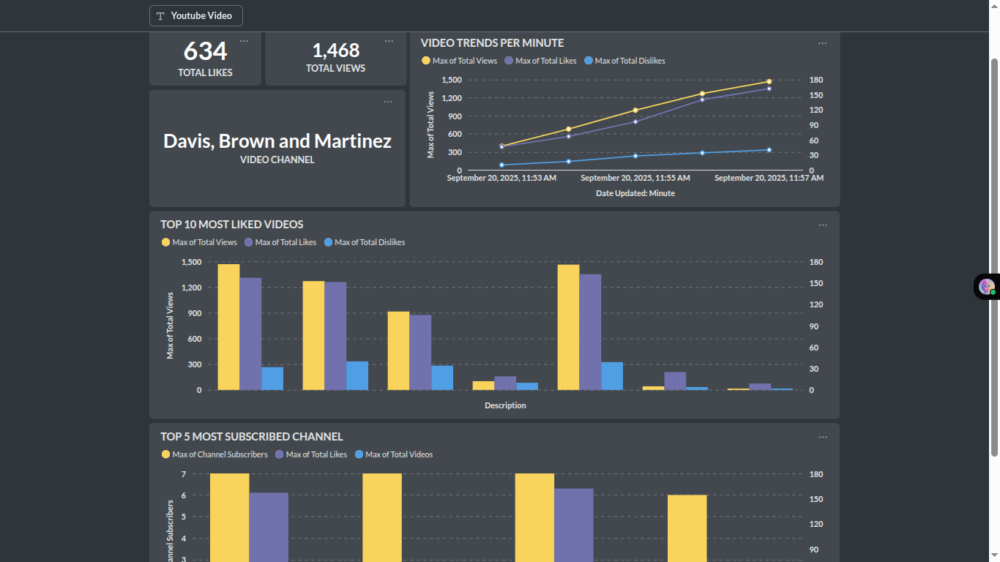

# Mini Data Platform - YouTube Data Platform

The **YouTube Mini Data Platform** is an end-to-end demo pipeline that simulates YouTube video statistics. Data is generated, stored in MinIO, processed with Airflow, loaded into PostgreSQL, and visualized in Metabase. It showcases the core stages of a modern data platform—collect, process, store, and visualize—in a lightweight, reproducible setup.

## Overview
A simulated data generator produces periodic snapshots of YouTube video and channel statistics, which are ingested into an S3-like object store (MinIO). From there, Apache Airflow orchestrates validation, transformation, and loading of the data into PostgreSQL. Finally, Metabase provides an interactive analytics layer, enabling users to explore trends, identify top channels, and monitor video performance over time.

---
The platform demonstrating the four core layer of a data pipeline:
1. Collect Data
2. Process Data 
3. Store Data
4. Visualize data


## Services Used
- **Airflow (Astro CLI)**: Orchestrates data ingestion and processing
- **PostgreSQL**: Database to stores processed data
- **MinIO**:  - file storage (like AWS S3)
- **Metabase**: creates charts and reports

### System Architecture

## Services Overview
1. ### **Data Generator**
    - Simulates YouTube video datasets (channels, videos, stats).
    - Periodically generates new CSV snapshots of updated video statistics.
    - Uploads CSVs to MinIO (acting as raw storage).
    - batch interval is set to 10min

2. ### **Minio**
    - Acts as the object store (S3-compatible).
    - Holds:
        - Raw data (CSV files from the generator)
        - Archived data (after processing)
        - Quarantined files (invalid schema files)
        - Transformed datasets (Staging for downstream load and analytics)

3. ### **Airflow (via Astro CLI)** 
    - Orchestrates the end-to-end pipeline.
    - DAG Workflow (Scheduled for every 10 min, with S3KeySensor waiting for uploads):
        1. **Extract**: Batch raw CSV files from MinIO.
        2. **Validate**: Check schema/columns.
            - Valid files → transformation
            - Invalid files → quarantine folder in MinIO
        3. **Transform:** Build derived datasets:
            - Trend 30s – Rolling metrics sampled every 30 seconds
            - Channel Stats – Aggregated statistics per channel
        4. **Load**: Insert transformed datasets into PostgreSQL tables.
        5. **Archive**: Move processed raw files into an archive/ folder in MinIO.

    

4. ### **PostgresSQL**
    - Stores transformed datasets for downstream analytics.
    - Two key tables (from current design):
        - `video_metrics` (trend data at 30s intervals)
        - `channel_stats` (aggregated per channel)

5. ### **Metabase**
    - Will be used to visualize the data stored in PostgreSQL.
    - Viusal found on the dashboard dashboards:
        - Trending videos over time( with ists, total like, view and channel name)
        - Top 5 most subscribed channels
        - Top 10 most liked videos
        image below show the dash board sample view
    

## Setup
1. Install Dependancies
    - Docker
    - Astronemer

2. Clone this repo
```bash
git clone https://github.com/EssumanG/youtube-data-platform.git
cd youtube-data-platform
```
3. Set envronment variables.
Create a .env file in the project root directory and copy the evnironment in the the **`example.env`** and paste in the .env file

4. Update values as needed in the airflow_settings.yaml.
    
    (Note: In airflow_settings.py, replace variables with those from your .env file.)

    the minio IP address found using the following command

    ```
    docker ps        # find minio ID or name
    docker inspect -f '{{range .NetworkSettings.Networks}}{{.IPAddress}}{{end}}' <container_id_or_name>
    ```

5. Start the platform

    ```
     set -a && source ../.env && set +a
    astro dev start -e ../.env
    ```

    This will start:

    - **Airflow** → http://localhost:8080
    - **PostgreSQL** → connect via pgAdmin/DBeaver
    - **MinIO** → http://localhost:9101
    - **Metabase** → http://localhost:3000 => *NB:login info can be found in example.env file*

    *NB: Check Airflow UI to confirm connections. If missing, update manually.*


6. Start the simulator
    ```bash
    cd ../data_generation_simulator 

    python main..py
    ```

---

### Project Sructure

```
├── airflow/                         # Extract, validate, transform, load helpers
│   ├── etl/                         # Extract, validate, transform, load helpers
│   │   ├── extract.py
│   │   ├── validate.py
│   │   ├── transform.py
│   │   ├── load.py
│   │   ├── move_files.py
│   │   └── archive.py
│   ├── dags/                        # Airflow DAG definitions
|   ├── airflow_seettings.yaml 
│   └── docker-compose.override.yml  # Extra service configs (Postgres, MinIO, etc.)
├── data_generation_simulator/                   # Data generator service
├── .env                         # Environment variables
└── README.md
```

## Dataset Schema

- ### **Raw Data (CSV uploaded by simulator)**:
Each generated file represents a batch snapshot of YouTube video stats.

| Column                | Type     | Description                              |
| --------------------- | -------- | ---------------------------------------- |
| `video_id`            | string   | Unique identifier for a video            |
| `channel_id`          | string   | Unique identifier for a channel          |
| `channel_name`        | string   | Channel’s name                           |
| `channel_subscribers` | int      | Subscriber count at the time of snapshot |
| `description`         | string   | Video description text                   |
| `total_views`         | int      | Total view count                         |
| `total_likes`         | int      | Total like count                         |
| `total_dislikes`      | int      | Total dislike count                      |
| `date_created`        | datetime | When video was first created             |
| `date_updated`        | datetime | When snapshot was taken                  |

- ### **Transformed Datasets**
Trend 30s (`video_metrics` table)
Rolling metrics sampled at 30-second intervals.

| Column           | Type     | Description                       |
| ---------------- | -------- | --------------------------------- |
| `date_updated`   | datetime | Time window (30s interval)        |
| `description`    | string   | Video description                 |
| `channel_name`   | string   | Channel name                      |
| `total_views`    | int      | Max views observed in interval    |
| `total_likes`    | int      | Max likes observed in interval    |
| `total_dislikes` | int      | Max dislikes observed in interval |

- ### **Channel Stats(`channel_stats` table)**:
Aggregated statistics per channel.

| Column                | Type   | Description                      |
| --------------------- | ------ | -------------------------------- |
| `channel_id`          | string | Channel ID                       |
| `channel_name`        | string | Channel name                     |
| `channel_subscribers` | int    | Latest subscriber count          |
| `total_videos`        | int    | Number of videos in dataset      |
| `total_views`         | int    | Max total views across videos    |
| `total_likes`         | int    | Max total likes across videos    |
| `total_dislikes`      | int    | Max total dislikes across videos |


## Next Steps
- Containerize the data generator
- Automate CI/CD for Airflow DAGs and ETL scripts